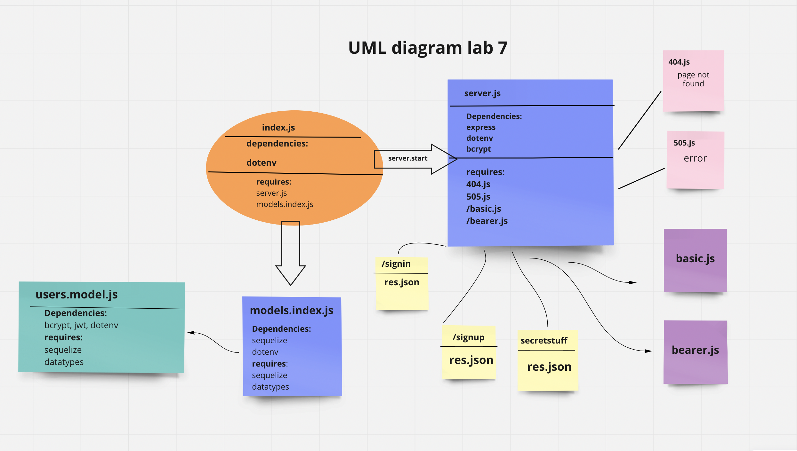

# bearer-auth

## UML Diagram

## links related to the project

[Heroku app](https://bearer-auth-sara.herokuapp.com/)

[Actions](https://github.com/saraaltayeh/bearer-auth/actions)

[pull request](https://github.com/saraaltayeh/bearer-auth/pull/2)
